  

 

I'm **Muhammad Noman**, a full-stack software engineer at **MK Technology Pvt Ltd** in Islamabad.
I build production systems end to end: mobile apps, realtime backends and deployments. My current focus is
**AI systems and how to secure them**: LLM applications, RAG, AI agents, and the controls that stop them being misused.

<table>
<tr>
<td width="33%" valign="top">

### AI engineering
- LLM applications and APIs
- RAG pipelines: ingestion, retrieval, citations
- AI agents with LangGraph
- Evaluation and observability
- Speech AI (ASR, streaming)

</td>
<td width="33%" valign="top">

### AI and application security
- Prompt-injection and jailbreak defense
- RAG data security and document permissions
- Agent tool permissions and approvals
- Threat modeling (OWASP LLM Top 10, MITRE ATLAS)
- AuthN/AuthZ, RBAC, audit logging

</td>
<td width="33%" valign="top">

### Full-stack and realtime
- Flutter mobile apps
- Node.js / TypeScript backends
- WebSockets, Socket.IO, MQTT
- PostgreSQL / MySQL
- Docker, Linux VPS, Nginx, CI/CD

</td>
</tr>
</table>

## Tech stack

  
   
  

**AI tooling:** LangGraph · LangChain · Qdrant · Ollama · OpenAI-compatible APIs · faster-whisper / CTranslate2 · ONNX Runtime · scikit-learn

## Featured work

<!-- PROJECTS:START -->
| Project | What it is | Stack |
|---|---|---|
| [**LLMSiege**](https://github.com/MuhammadNoman2/llm-siege) | LLM attack and defense lab: one assistant built three ways (vulnerable, basic guardrails, secure by architecture) plus an automated attack harness, mapped to OWASP LLM Top 10 and MITRE ATLAS | Python · FastAPI · pytest · Docker |
| [**Agent Warden**](https://github.com/MuhammadNoman2/agent-warden) | Secure AI agent platform: every tool call the model requests goes through a policy engine, with human approvals, tenant isolation, taint tracking and a hash-chained audit log | Python · FastAPI · LangGraph · Qdrant · React |
| [**Quran AI Recitation API**](https://github.com/MuhammadNoman2/quran-ai-api) | Realtime Quran recitation recognition with word-level mistake detection over REST and WebSocket. Runs on CPU, with no GPU needed | Python · FastAPI · WebSockets · CTranslate2 · ONNX |
| [**MK Track**](https://github.com/MuhammadNoman2/mk-track) | Multi-tenant SaaS fleet tracking: ESP32 hardware trackers, live dashboard, geofencing, alerts, reports *(case study, as the product is commercial)* | Node.js · TypeScript · PostgreSQL · MQTT · Socket.IO · React · Flutter |
<!-- PROJECTS:END -->

## GitHub activity

  

## Connect

---

Building AI systems and securing them · Islamabad, Pakistan · open to remote work with UK and international teams

